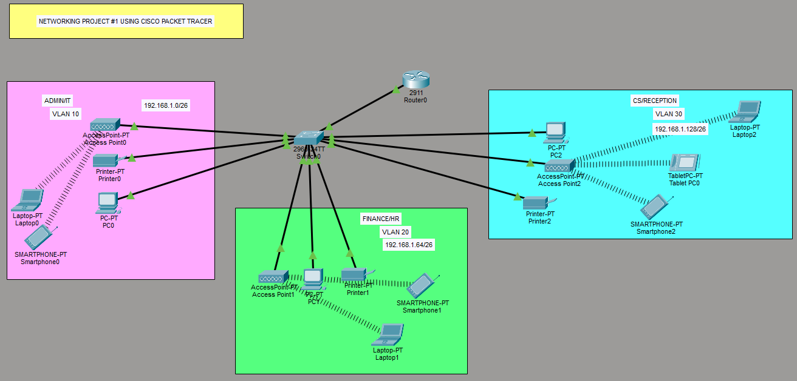

# SOHO Network Design & Implementation

> **Summary:** A segmented SOHO branch network built in Cisco Packet Tracer
> *(version: [fill in]*), using one Cisco 2911 router and one Cisco 2960
> switch. Demonstrates VLAN segmentation, router-on-a-stick inter-VLAN
> routing, per-department DHCP scoping with excluded/static addressing,
> trunk hardening, and wired, wireless, same-VLAN, and cross-VLAN
> connectivity testing.

**Attribution:** Built by following [this guided Packet Tracer
walkthrough](https://youtu.be/F_dSpaTMyuA), then extended beyond the
tutorial with: wireless-to-wired and wireless-to-wireless cross-VLAN testing
(Tests 9–11), a full 12-test verification suite with screenshot evidence,
DHCP excluded addresses and static printer addressing (Section 8), trunk
VLAN restriction (Section 9), a post-hardening regression test (Section 10),
and `show`-command verification output (Section 11).

---

## 1. Case Study

XYZ company is a fast-growing company in Eastern Australia with more than 2 million customers globally. The company deals with selling and buying of food items, which are basically operated from the headquarters. The company is intending to open a branch near the local village Bonalbo. Thus, the company requires young IT graduates to design the network for the branch. The network is intended to operate separately from the HQ network.

## 2. Requirements

- One Cisco router and one Cisco switch
- Three departments: **Admin/IT**, **Finance/HR**, **Customer Service/Reception**
- Each department on a separate VLAN
- Each department has its own wireless network
- Hosts obtain IPv4 addresses automatically (DHCP)
- All departments can communicate with each other
- ISP-assigned base network: `192.168.1.0`

## 3. Technologies Implemented

1. Simple network topology (1 router, 1 switch)
2. Correct cabling (straight-through throughout, as appropriate for the unlike-device connections in this topology — see Section 12)
3. VLAN creation and port assignment
4. Subnetting and IP addressing
5. Inter-VLAN routing (router-on-a-stick)
6. DHCP server configuration (router as DHCP server)
7. WLAN / access point configuration
8. Host device configuration
9. Testing and verification

---

## 4. Network Topology



| Device | Role |
|---|---|
| Router0 | Router-on-a-stick, DHCP server |
| Switch | VLAN trunking, access ports |
| Access Point 0/1/2 | Wireless per department |
| PC0, PC1, PC2 | Wired department hosts |
| Printer0/1/2 | Department printers |
| Laptop0/1/2, Smartphone0/1/2, Tablet PC0 | Wireless department clients |

---

## 5. IP Addressing Plan

Base network: `192.168.1.0/24`, subnetted into three `/26` blocks (2 borrowed bits → 4 subnets of 64 addresses each, 62 usable hosts per subnet, 3 subnets used and one reserved for future growth).

| Department | VLAN | Subnet | Usable Range | Gateway (Router subinterface) | Broadcast |
|---|---|---|---|---|---|
| Admin/IT | 10 | 192.168.1.0/26 | .1 – .62 | 192.168.1.1 | 192.168.1.63 |
| Finance/HR | 20 | 192.168.1.64/26 | .65 – .126 | 192.168.1.65 | 192.168.1.127 |
| CS/Reception | 30 | 192.168.1.128/26 | .129 – .190 | 192.168.1.129 | 192.168.1.191 |


---

## 6. Configuration Summary

### 6.1 Switch — VLAN Creation & Access Ports

Created three VLANs and assigned access ports per department: Fa0/2–4 to
VLAN 10 (Admin/IT), Fa0/5–7 to VLAN 20 (Finance/HR), and Fa0/8–10 to VLAN 30
(CS/Reception). Packet Tracer auto-creates each VLAN the first time it's
referenced in a `switchport access vlan` command.

```
Switch>en
Switch#conf t
Switch(config)#int range fa0/2-4
Switch(config-if-range)#switchport mode access
Switch(config-if-range)#switchport access vlan 10
Switch(config-if-range)#exit
Switch(config)#int range fa0/5-7
Switch(config-if-range)#switchport mode access
Switch(config-if-range)#switchport access vlan 20
Switch(config-if-range)#exit
Switch(config)#int range fa0/8-10
Switch(config-if-range)#switchport mode access
Switch(config-if-range)#switchport access vlan 30
Switch(config-if-range)#exit
Switch(config)#do wr
```

### 6.2 Switch — Trunk Configuration

Set Fa0/1 (the uplink to the router) to trunk mode so all three VLANs' traffic
can pass to the router for inter-VLAN routing.

```
Switch>en
Switch#conf t
Enter configuration commands, one per line.  End with CNTL/Z.
Switch(config)#int fa0/1
Switch(config-if)#switchport mode trunk
Switch(config-if)#do wr
```

### 6.3 Router — Subinterfaces (Router-on-a-Stick)

Configured one subinterface per VLAN on the router's Gi0/0 link, each with
802.1Q encapsulation matching its VLAN ID and the gateway address for that
department's subnet.

```
Router>en
Router#conf t
Router(config)#int g0/0
Router(config-if)#no sh
Router(config-if)#exit
Router(config)#int g0/0.10
Router(config-subif)#encapsulation dot1Q 10
Router(config-subif)#ip address 192.168.1.1 255.255.255.192
Router(config-subif)#exit
Router(config)#int g0/0.20
Router(config-subif)#encapsulation dot1Q 20
Router(config-subif)#ip address 192.168.1.65 255.255.255.192
Router(config-subif)#exit
Router(config)#int g0/0.30
Router(config-subif)#encapsulation dot1Q 30
Router(config-subif)#ip address 192.168.1.129 255.255.255.192
Router(config-subif)#do wr
```

### 6.4 Router — DHCP Pools

Configured one DHCP pool per department, scoped to its own /26 subnet, with
the router subinterface as both default gateway and DNS server.

```
Router(config)#service dhcp
Router(config)#ip dhcp pool Admin-Pool
Router(dhcp-config)#network 192.168.1.0 255.255.255.192
Router(dhcp-config)#default-router 192.168.1.1
Router(dhcp-config)#dns-server 192.168.1.1
Router(dhcp-config)#domain-name Admin.com
Router(dhcp-config)#exit
Router(config)#ip dhcp pool Finance-Pool
Router(dhcp-config)#network 192.168.1.64 255.255.255.192
Router(dhcp-config)#default-router 192.168.1.65
Router(dhcp-config)#dns-server 192.168.1.65
Router(dhcp-config)#domain-name Finance.com
Router(dhcp-config)#exit
Router(config)#ip dhcp pool CS-Pool
Router(dhcp-config)#network 192.168.1.128 255.255.255.192
Router(dhcp-config)#default-router 192.168.1.129
Router(dhcp-config)#dns-server 192.168.1.129
Router(dhcp-config)#domain-name CS.com
Router(dhcp-config)#exit
Router(config)#do wr
```

### 6.5 Access Points

Each department's AP was configured with its own SSID, mapped to its VLAN via
the corresponding access port on the switch.

**Access Point0 — Admin/IT (VLAN 10)**


**Access Point1 — Finance/HR (VLAN 20)**


**Access Point2 — CS/Reception (VLAN 30)**


### 6.6 End Device Verification

Each PC and printer was set to obtain an IPv4 address automatically. The
screenshots below confirm every device received an address from its
department's DHCP pool.

| Device | Department | Verification |
|---|---|---|
| PC0 | Admin/IT |  |
| PC1 | Finance/HR |  |
| PC2 | CS/Reception |  |
| Printer0 | Admin/IT |  |
| Printer1 | Finance/HR |  |
| Printer2 | CS/Reception |  |

All devices obtained IPv4 addresses automatically within their department's
subnet, confirming DHCP scoping is correct per VLAN.

## 7. Testing & Verification

The following tests confirm the network meets the case study's core
requirement: devices in all departments can communicate with each other,
while remaining logically separated by VLAN.

| # | Test | From | To | Expected Result | Actual Result |
|---|---|---|---|---|---|
| 1 | Same-VLAN ping | PC0 (Admin) | Printer0 (Admin) | Success | Success |
| 2 | Same-VLAN ping | PC1 (Finance) | Printer1 (Finance) | Success | Success |
| 3 | Cross-VLAN ping | PC0 (Admin) | PC1 (Finance) | Success (via router-on-a-stick) | Success |
| 4 | Cross-VLAN ping | PC2 (CS) | PC1 (Finance) | Success | Success |
| 5 | Cross-VLAN ping | PC0 (Admin) | PC2 (CS) | Success | Success |
| 6 | Wireless DHCP lease | Smartphone0 (Admin) | not applicable | Address in 192.168.1.2-62, gateway .1 | Success |
| 7 | Wireless DHCP lease | Laptop1 (Finance) | not applicable | Address in 192.168.1.66-126, gateway .65 | Success |
| 8 | Wireless DHCP lease | Tablet PC0 (CS) | not applicable | Address in 192.168.1.130-190, gateway .129 | Success |
| 9 | Wireless-to-wired ping (same VLAN) | Tablet PC0 (CS) | PC2 or Printer2 | Success | Success |
| 10 | Wireless-to-wired ping (cross-VLAN) | Laptop1 (Finance) | PC0 (Admin) | Success | Success |
| 11 | Wireless-to-wireless ping (cross-VLAN) | Smartphone0 (Admin) | Tablet PC0 (CS) | Success | Success |
| 12 | Cross-VLAN traceroute | PC0 (Admin) | PC2 (CS) | Path routes through 192.168.1.1 | Success |

---

## 8. DHCP Hardening — Excluded Addresses & Static Printers

Gateway addresses (.1, .65, .129) initially sat inside their own DHCP pools,
meaning the server could theoretically hand one out to a client. Excluded a
small block per subnet, covering the gateway and a static range reserved for
infrastructure devices such as printers.

```
Router>en
Router#conf t
Router(config)#ip dhcp excluded-address 192.168.1.1 192.168.1.10
Router(config)#ip dhcp excluded-address 192.168.1.65 192.168.1.74
Router(config)#ip dhcp excluded-address 192.168.1.129 192.168.1.138
Router(config)#exit
Router#clear ip dhcp binding *
Router#wr
```

Printers were then moved from DHCP to static addressing within their
department's excluded range:

| Device | Static IP | Mask | Gateway |
|---|---|---|---|
| Printer0 | 192.168.1.2 | 255.255.255.192 | 192.168.1.1 |
| Printer1 | 192.168.1.66 | 255.255.255.192 | 192.168.1.65 |
| Printer2 | 192.168.1.130 | 255.255.255.192 | 192.168.1.129 |

## 9. Trunk Restriction

Restricted the switch-to-router trunk to only the VLANs actually in use,
rather than allowing all VLANs (including the default VLAN 1) across the
link.

```
Switch>en
Switch#conf t
Switch(config)#int fa0/1
Switch(config-if)#switchport trunk allowed vlan 10,20,30
Switch(config-if)#do wr
```

## 10. Regression Test (Post-Hardening)

Sections 8 and 9 changed live configuration after the original test suite in
Section 7 passed, so a subset of tests were rerun to confirm nothing broke.

| # | Test | From | To | Expected Result | Actual Result |
|---|---|---|---|---|---|
| R1 | Same-VLAN ping | PC0 (Admin) | Printer0 (Admin) | Success | Success |
| R2 | Cross-VLAN ping | PC0 (Admin) | PC1 (Finance) | Success | Success |
| R3 | Wireless DHCP lease | Smartphone0 (Admin) | not applicable | Address in 192.168.1.11-62, gateway .1 (range shifted after exclusion) | Success |

## 11. Verification Commands

Command output confirming the final running state of the switch and router,
captured after the changes in Sections 8 and 9.

```
Switch>show vlan brief

VLAN Name                             Status    Ports
---- -------------------------------- --------- -------------------------------
1    default                          active    Fa0/11, Fa0/12, Fa0/13, Fa0/14
                                                Fa0/15, Fa0/16, Fa0/17, Fa0/18
                                                Fa0/19, Fa0/20, Fa0/21, Fa0/22
                                                Fa0/23, Fa0/24, Gig0/1, Gig0/2
10   VLAN0010                         active    Fa0/2, Fa0/3, Fa0/4
20   VLAN0020                         active    Fa0/5, Fa0/6, Fa0/7
30   VLAN0030                         active    Fa0/8, Fa0/9, Fa0/10
1002 fddi-default                     active    
1003 token-ring-default               active    
1004 fddinet-default                  active    
1005 trnet-default                    active
```

```
Switch>show interfaces trunk
Port        Mode         Encapsulation  Status        Native vlan
Fa0/1       on           802.1q         trunking      1

Port        Vlans allowed on trunk
Fa0/1       10,20,30

Port        Vlans allowed and active in management domain
Fa0/1       10,20,30

Port        Vlans in spanning tree forwarding state and not pruned
Fa0/1       10,20,30
```

```
Router>show ip interface brief
Interface              IP-Address      OK? Method Status                Protocol 
GigabitEthernet0/0     unassigned      YES unset  up                    up 
GigabitEthernet0/0.10  192.168.1.1     YES manual up                    up 
GigabitEthernet0/0.20  192.168.1.65    YES manual up                    up 
GigabitEthernet0/0.30  192.168.1.129   YES manual up                    up 
GigabitEthernet0/1     unassigned      YES unset  administratively down down 
GigabitEthernet0/2     unassigned      YES unset  administratively down down 
Vlan1                  unassigned      YES unset  administratively down down
```

```
Router>show ip dhcp binding
IP address       Client-ID/              Lease expiration        Type
                 Hardware address
192.168.1.12     00D0.D3AE.ABCB           --                     Automatic
192.168.1.11     0002.173C.950D           --                     Automatic
192.168.1.13     00E0.F734.4A35           --                     Automatic
192.168.1.76     0003.E489.70D8           --                     Automatic
192.168.1.77     0060.2F08.0AB0           --                     Automatic
192.168.1.78     0030.F2B8.DE63           --                     Automatic
192.168.1.139    0060.3E30.0EE4           --                     Automatic
192.168.1.141    0001.635E.EAD2           --                     Automatic
192.168.1.143    0001.9789.B7D7           --                     Automatic
192.168.1.142    0001.C9C5.33A8           --                     Automatic
```

```
Router>show ip dhcp pool 

Pool Admin-Pool :
 Utilization mark (high/low)    : 100 / 0
 Subnet size (first/next)       : 0 / 0 
 Total addresses                : 62
 Leased addresses               : 3
 Excluded addresses             : 3
 Pending event                  : none

 1 subnet is currently in the pool
 Current index        IP address range                    Leased/Excluded/Total
 192.168.1.1          192.168.1.1      - 192.168.1.62      3    / 3     / 62

Pool Finance-Pool :
 Utilization mark (high/low)    : 100 / 0
 Subnet size (first/next)       : 0 / 0 
 Total addresses                : 62
 Leased addresses               : 3
 Excluded addresses             : 3
 Pending event                  : none

 1 subnet is currently in the pool
 Current index        IP address range                    Leased/Excluded/Total
 192.168.1.65         192.168.1.65     - 192.168.1.126     3    / 3     / 62

Pool CS.com :
 Utilization mark (high/low)    : 100 / 0
 Subnet size (first/next)       : 0 / 0 
 Total addresses                : 62
 Leased addresses               : 4
 Excluded addresses             : 3
 Pending event                  : none

 1 subnet is currently in the pool
 Current index        IP address range                    Leased/Excluded/Total
 192.168.1.129        192.168.1.129    - 192.168.1.190     4    / 3     / 62
```

```
Router>show ip route
Codes: L - local, C - connected, S - static, R - RIP, M - mobile, B - BGP
       D - EIGRP, EX - EIGRP external, O - OSPF, IA - OSPF inter area
       N1 - OSPF NSSA external type 1, N2 - OSPF NSSA external type 2
       E1 - OSPF external type 1, E2 - OSPF external type 2, E - EGP
       i - IS-IS, L1 - IS-IS level-1, L2 - IS-IS level-2, ia - IS-IS inter area
       * - candidate default, U - per-user static route, o - ODR
       P - periodic downloaded static route

Gateway of last resort is not set

     192.168.1.0/24 is variably subnetted, 6 subnets, 2 masks
C       192.168.1.0/26 is directly connected, GigabitEthernet0/0.10
L       192.168.1.1/32 is directly connected, GigabitEthernet0/0.10
C       192.168.1.64/26 is directly connected, GigabitEthernet0/0.20
L       192.168.1.65/32 is directly connected, GigabitEthernet0/0.20
C       192.168.1.128/26 is directly connected, GigabitEthernet0/0.30
L       192.168.1.129/32 is directly connected, GigabitEthernet0/0.30
```

## 12. Port & Cabling Reference

All links use copper straight-through cabling, since every connection in
this topology is between unlike device types (switch–router, switch–PC,
switch–printer, switch–AP); no crossover cabling was required.

| Switch Port | Connected Device | Device Port | VLAN | Mode | Cable |
|---|---|---|---|---|---|
| Fa0/1 | Router0 | Gi0/0 | 10,20,30 | Trunk | Copper straight-through |
| Fa0/2 | Access Point0 | | 10 | Access | Copper straight-through |
| Fa0/3 | Printer0 | | 10 | Access | Copper straight-through |
| Fa0/4 | PC0 | Fa0 | 10 | Access | Copper straight-through |
| Fa0/5 | Access Point1 | | 20 | Access | Copper straight-through |
| Fa0/6 | PC1 | Fa0 | 20 | Access | Copper straight-through |
| Fa0/7 | Printer1 | | 20 | Access | Copper straight-through |
| Fa0/8 | PC2 | Fa0 | 30 | Access | Copper straight-through |
| Fa0/9 | Access Point2 | | 30 | Access | Copper straight-through |
| Fa0/10 | Printer2 | | 30 | Access | Copper straight-through |

---

## 13. Key Learnings

- Router-on-a-stick requires the subinterface encapsulation VLAN ID to
  exactly match the VLAN tag the switch sends over the trunk — a mismatch
  here silently breaks inter-VLAN routing with no error message.
- Subnetting a /24 into three /26s made VLAN and DHCP scoping simple, but in
  a real deployment I'd size subnets closer to actual headcount per
  department rather than splitting evenly, to avoid wasting address space.
- The trunk only needs to be configured on the **switch** side
  (`switchport mode trunk` on Fa0/1). The router side never enters trunk
  mode at all — it uses 802.1Q subinterfaces (`encapsulation dot1Q
  <vlan-id>`), one per VLAN, which achieve the same tagging without a
  "trunk" command. Missing the switch-side trunk, or missing a router
  subinterface for a given VLAN, leaves that VLAN unable to reach the
  router.
- Excluding the gateway and static-device addresses from a DHCP pool isn't
  just tidy practice — without it, the pool can hand a client the same
  address already in use by the default gateway or a static printer.
- Wireless client behavior in Packet Tracer (SSID, security mode, VLAN
  mapping via the access port) mirrors real AP configuration closely enough
  to be a genuinely useful proxy for hands-on wireless setup.

