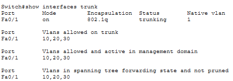

# SOHO Network Design & Implementation

---

## 1. Case Study

XYZ company is a fast-growing company in Eastern Australia with more than 2 million customers globally. The company deals with selling and buying of food items, which are basically operated from the headquarters. The company is intending to open a branch near the local village Bonalbo. Thus, the company requires young IT graduates  to design the  network for the branch. The network is intended to operate separately from the HQ network.

## 2. Requirements

- One Cisco router and one Cisco switch
- Three departments: **Admin/IT**, **Finance/HR**, **Customer Service/Reception**
- Each department on a separate VLAN
- Each department has its own wireless network
- Hosts obtain IPv4 addresses automatically (DHCP)
- All departments can communicate with each other
- ISP-assigned base network: `192.168.1.0`

## 3. Technologies Implemented

1. Simple network topology (1 router, 1 switch)
2. Correct cabling (straight-through / crossover / trunk as needed)
3. VLAN creation and port assignment
4. Subnetting and IP addressing
5. Inter-VLAN routing (router-on-a-stick)
6. DHCP server configuration (router as DHCP server)
7. WLAN / access point configuration
8. Host device configuration
9. Testing and verification

---

## 4. Network Topology


| Device | Role |
|---|---|
| Router0 | Router-on-a-stick, DHCP server |
| Switch | VLAN trunking, access ports |
| Access Point 0/1/2 | Wireless per department |
| PC0, PC1, PC2 | Wired department hosts |
| Printer0/1/2 | Department printers |
| Laptop0/1/2, Smartphone0/1/2, Tablet PC0 | Wireless department clients |

---

## 5. IP Addressing Plan

Base network: `192.168.1.0/24`, subnetted into three `/26` blocks (2 borrowed bits → 4 subnets of 64 hosts each, 3 used).

| Department | VLAN | Subnet | Usable Range | Gateway (Router subinterface) | Broadcast |
|---|---|---|---|---|---|
| Admin/IT | 10 | 192.168.1.0/26 | .1 – .62 | 192.168.1.1 | 192.168.1.63 |
| Finance/HR | 20 | 192.168.1.64/26 | .65 – .126 | 192.168.1.65 | 192.168.1.127 |
| CS/Reception | 30 | 192.168.1.128/26 | .129 – .190 | 192.168.1.129 | 192.168.1.191 |


---

## 6. Configuration Summary

### 6.1 Switch — VLAN Creation & Access Ports

Created three VLANs and assigned access ports per department: Fa0/2–4 to
VLAN 10 (Admin/IT), Fa0/5–7 to VLAN 20 (Finance/HR), and Fa0/8–10 to VLAN 30
(CS/Reception). Packet Tracer auto-creates each VLAN the first time it's
referenced in a `switchport access vlan` command.

```
Switch>en
Switch#conf t
Switch(config)#int range fa0/2-4
Switch(config-if-range)#switchport mode access
Switch(config-if-range)#switchport access vlan 10
Switch(config-if-range)#exit
Switch(config)#int range fa0/5-7
Switch(config-if-range)#switchport mode access
Switch(config-if-range)#switchport access vlan 20
Switch(config-if-range)#exit
Switch(config)#int range fa0/8-10
Switch(config-if-range)#switchport mode access
Switch(config-if-range)#switchport access vlan 30
Switch(config-if-range)#exit
Switch(config)#do wr
```

### 6.2 Switch — Trunk Configuration

Set Fa0/1 (the uplink to the router) to trunk mode so all three VLANs' traffic
can pass to the router for inter-VLAN routing.

```
Switch>en
Switch#conf t
Enter configuration commands, one per line.  End with CNTL/Z.
Switch(config)#int fa0/1
Switch(config-if)#switchport mode trunk
Switch(config-if)#do wr
```

### 6.3 Router — Subinterfaces (Router-on-a-Stick)

Configured one subinterface per VLAN on the router's Gi0/0 link, each with
802.1Q encapsulation matching its VLAN ID and the gateway address for that
department's subnet.

```
Router>en
Router#conf t
Router(config)#int g0/0
Router(config-if)#no sh
Router(config-if)#exit
Router(config)#int g0/0.10
Router(config-subif)#encapsulation dot1Q 10
Router(config-subif)#ip address 192.168.1.1 255.255.255.192
Router(config-subif)#exit
Router(config)#int g0/0.20
Router(config-subif)#encapsulation dot1Q 20
Router(config-subif)#ip address 192.168.1.65 255.255.255.192
Router(config-subif)#exit
Router(config)#int g0/0.30
Router(config-subif)#encapsulation dot1Q 30
Router(config-subif)#ip address 192.168.1.129 255.255.255.192
Router(config-subif)#do wr
```

### 6.4 Router — DHCP Pools

Configured one DHCP pool per department, scoped to its own /26 subnet, with
the router subinterface as both default gateway and DNS server.

```
Router(config)#service dhcp
Router(config)#ip dhcp pool Admin-Pool
Router(dhcp-config)#network 192.168.1.0 255.255.255.192
Router(dhcp-config)#default-router 192.168.1.1
Router(dhcp-config)#dns-server 192.168.1.1
Router(dhcp-config)#domain-name Admin.com
Router(dhcp-config)#exit
Router(config)#ip dhcp pool Finance-Pool
Router(dhcp-config)#network 192.168.1.64 255.255.255.192
Router(dhcp-config)#default-router 192.168.1.65
Router(dhcp-config)#dns-server 192.168.1.65
Router(dhcp-config)#domain-name Finance.com
Router(dhcp-config)#exit
Router(config)#ip dhcp pool CS-Pool
Router(dhcp-config)#network 192.168.1.128 255.255.255.192
Router(dhcp-config)#default-router 192.168.1.129
Router(dhcp-config)#dns-server 192.168.1.129
Router(dhcp-config)#domain-name CS.com
Router(dhcp-config)#exit
Router(config)#do wr
```

### 6.5 Access Points

Each department's AP was configured with its own SSID, mapped to its VLAN via
the corresponding access port on the switch.

**Access Point0 — Admin/IT (VLAN 10)**


**Access Point1 — Finance/HR (VLAN 20)**


**Access Point2 — CS/Reception (VLAN 30)**


### 6.6 End Device Verification

Each PC and printer was set to obtain an IPv4 address automatically. The
screenshots below confirm every device received an address from its
department's DHCP pool.

| Device | Department | Verification |
|---|---|---|
| PC0 | Admin/IT |  |
| PC1 | Finance/HR |  |
| PC2 | CS/Reception |  |
| Printer0 | Admin/IT |  |
| Printer1 | Finance/HR |  |
| Printer2 | CS/Reception |  |

All devices obtained IPv4 addresses automatically within their department's
subnet, confirming DHCP scoping is correct per VLAN.

## 7. Testing & Verification

The following tests confirm the network meets the case study's core
requirement: devices in all departments can communicate with each other,
while remaining logically separated by VLAN.

| # | Test | From | To | Expected Result | Actual Result |
|---|---|---|---|---|---|
| 1 | Same-VLAN ping | PC0 (Admin) | Printer0 (Admin) | Success | Success |
| 2 | Same-VLAN ping | PC1 (Finance) | Printer1 (Finance) | Success | Success |
| 3 | Cross-VLAN ping | PC0 (Admin) | PC1 (Finance) | Success (via router-on-a-stick) | Success |
| 4 | Cross-VLAN ping | PC2 (CS) | PC1 (Finance) | Success | Success |
| 5 | Cross-VLAN ping | PC0 (Admin) | PC2 (CS) | Success | Success |
| 6 | Wireless DHCP lease | Smartphone0 (Admin) | not applicable | Address in 192.168.1.2-62, gateway .1 | Success |
| 7 | Wireless DHCP lease | Laptop1 (Finance) | not applicable | Address in 192.168.1.66-126, gateway .65 | Success |
| 8 | Wireless DHCP lease | Tablet PC0 (CS) | not applicable | Address in 192.168.1.130-190, gateway .129 | Success |
| 9 | Wireless-to-wired ping (same VLAN) | Tablet PC0 (CS) | PC2 or Printer2 | Success | Success |
| 10 | Wireless-to-wired ping (cross-VLAN) | Laptop1 (Finance) | PC0 (Admin) | Success | Success |
| 11 | Wireless-to-wireless ping (cross-VLAN) | Smartphone0 (Admin) | Tablet PC0 (CS) | Success | Success |
| 12 | Cross-VLAN traceroute | PC0 (Admin) | PC2 (CS) | Path routes through 192.168.1.1 | Success |

---

## 8. DHCP Hardening — Excluded Addresses

Gateway addresses (.1, .65, .129) initially sat inside their own DHCP pools,
meaning the server could theoretically hand one out to a client. Excluded a
small block per subnet, covering the gateway and a static range reserved for
infrastructure devices such as printers.

```
Router>en
Router#conf t
Router(config)#ip dhcp excluded-address 192.168.1.1 192.168.1.10
Router(config)#ip dhcp excluded-address 192.168.1.65 192.168.1.74
Router(config)#ip dhcp excluded-address 192.168.1.129 192.168.1.138
Router(config)#exit
Router#clear ip dhcp binding *
Router#wr
```

## 9. Trunk Restriction

Restricted the switch-to-router trunk to only the VLANs actually in use,
rather than allowing all VLANs (including the default VLAN 1) across the
link.

```
Switch>en
Switch#conf t
Switch(config)#int fa0/1
Switch(config-if)#switchport trunk allowed vlan 10,20,30
Switch(config-if)#do wr
```



## 10. Regression Test (Post-Hardening)

Sections 8 and 9 changed live configuration after the original test suite in
Section 7 passed, so a subset of tests were rerun to confirm nothing broke.

| # | Test | From | To | Expected Result | Actual Result |
|---|---|---|---|---|---|
| R1 | Same-VLAN ping | PC0 (Admin) | Printer0 (Admin, now static) | Success | *[PASTE]* |
| R2 | Cross-VLAN ping | PC0 (Admin) | PC1 (Finance) | Success | *[PASTE]* |
| R3 | Wireless DHCP lease | Smartphone0 (Admin) | not applicable | Address in 192.168.1.11-62, gateway .1 (range shifted after exclusion) | *[PASTE]* |

*[If anything failed here, document the symptom, the command used to
diagnose it, and the fix in a Troubleshooting Log section.]*

## 11. Verification Commands

Command output confirming the final running state of the switch and router,
captured after the changes in Sections 8 and 9.

| Device | Command | What to notice |
|---|---|---|
| Switch | `show vlan brief` | Ports assigned to the correct VLANs; Fa0/1 does not appear in any VLAN's port list because it's a trunk |
| Switch | `show interfaces trunk` | Fa0/1 trunking, allowed VLANs limited to 10,20,30 |
| Router | `show ip interface brief` | All three subinterfaces up/up with the correct gateway addresses |
| Router | `show ip dhcp binding` | Wired and wireless clients leased from the correct pool, gateway/static range excluded |
| Router | `show ip dhcp pool` | Excluded address ranges reflected per pool |
| Router | `show ip route` | Three connected (C) and local (L) routes — no static routes needed for inter-VLAN routing |

```
*[PASTE: show vlan brief]*
```

```
*[PASTE: show interfaces trunk]*
```

```
*[PASTE: show ip interface brief]*
```

```
*[PASTE: show ip dhcp binding]*
```

```
*[PASTE: show ip dhcp pool]*
```

```
*[PASTE: show ip route]*
```

## 12. Port & Cabling Reference

All links use copper straight-through cabling, since every connection in
this topology is between unlike device types (switch–router, switch–PC,
switch–printer, switch–AP); no crossover cabling was required.

| Switch Port | Connected Device | Device Port | VLAN | Mode | Cable |
|---|---|---|---|---|---|
| Fa0/1 | Router0 | Gi0/0 | 10,20,30 | Trunk | Copper straight-through |
| Fa0/2 | *[fill in]* | | 10 | Access | Copper straight-through |
| Fa0/3 | *[fill in]* | | 10 | Access | Copper straight-through |
| Fa0/4 | *[fill in]* | | 10 | Access | Copper straight-through |
| Fa0/5 | *[fill in]* | | 20 | Access | Copper straight-through |
| Fa0/6 | *[fill in]* | | 20 | Access | Copper straight-through |
| Fa0/7 | *[fill in]* | | 20 | Access | Copper straight-through |
| Fa0/8 | *[fill in]* | | 30 | Access | Copper straight-through |
| Fa0/9 | *[fill in]* | | 30 | Access | Copper straight-through |
| Fa0/10 | *[fill in]* | | 30 | Access | Copper straight-through |

*[Verify against `show interfaces status` or by hovering over each link in
Packet Tracer, then fill in the Connected Device column above.]*

